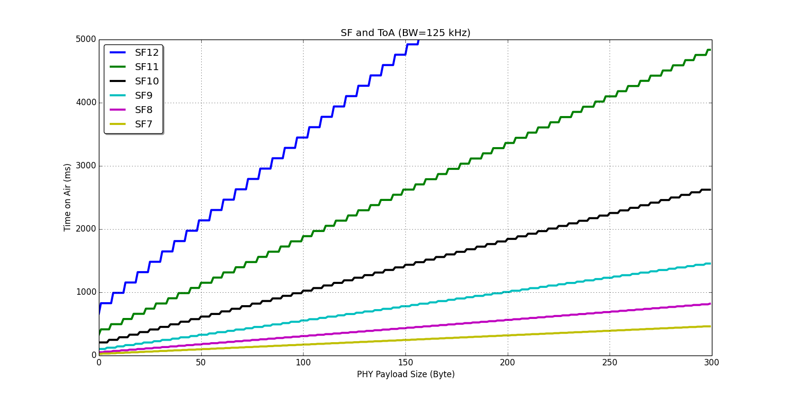

lorawan_toa
===========

The time on air calculator of LoRa in Python.
This script refers to the section 4.1.1.6. LoRaTM Packet Structure,
[SX1276/77/78/79 Datasheet][http://www.semtech.com/images/datasheet/sx1276_77_78_79.pdf].

## Usage

    Usage: lorawan_toa.py (sf) (size) [bw] [de]
        size: PHY Payload siz (= MAC Payload + 5)
        bw: bandwidth. default is 125 kHz.
        de: low data optimization. default is 0.

## graph_as923.py

    It makes a set of figures about Time on Air and PHYPayload size,
    especially AS923 using matlib like below.

