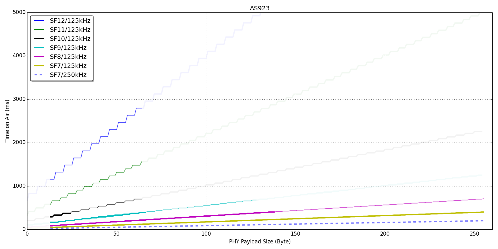

LoRa/LoRaWAN Time on Air calculator
===================================

A calculator of the time on air (ToA) of LoRa/LoRaWAN PHY frame in Python.

(28-Aug-2020) Python2 has sunset already.  For Python3, toa.py has been added.  Don't worry.  lorawan_toa.py is not changed for backward compatibility.

This script refers to the section 4.1.1.6. LoRa Packet Structure,
[SX1276/77/78/79 Datasheet rev.5][http://www.semtech.com/images/datasheet/sx1276.pdf].

The default parameters of the equation is based on LoRaWAN AS923
in the LoRaWAN regional parameters v1.1.

## Note

The default value of Explicit Header is enable.
It is guessed from the PHY frame format
though there is no explit text in the LoRaWAN specification.

The value of LowDataRateOptimization is set automatically
when the symbol duration exceeds 16ms.
Because the datasheet requires that it must be used
when the symbol duration exceeds 16ms.
This is the case below:

- SF=12 and 11 in 125 kHz.
- SF=12 in 250 kHz.

You can disable this feature by the --disable-auto-ldro option.
The LDRO is disabled by default if you disable the auto LDRO.
If you want to enable the LDRO, you can specify the --enable-ldro option.

In the downlink stream, the CRC at the tail of the PHY frame is not used.
To calculate the ToA for the downlink stream,
the --downlink option should be specified.

## Usage

```
usage: toa.py [-h] [--band-width NUMBER] [--disable-auto-ldro] [--enable-ldro]
              [--disable-eh] [--downlink] [--disable-crc] [--cr NUMBER]
              [--preamble NUMBER] [--duty-cycle NUMBER] [-v] [-d]
              SF SIZE

LoRa Time on Air calculator.

positional arguments:
  SF                   Spreading Factor. It should be from 7 to 12.
  SIZE                 PHY payload size in byte. Remember that PHY payload
                       (i.e. MAC frame) is consist of MHDR(1) + MAC payload +
                       MIC(4), or MHDR(1) + FHDR(7) + FPort(1) + APP + MIC(4).
                       For example, SIZE for Join Request is going to be 23.
                       If the size of an application message (APP) is 12, SIZE
                       is going to be 25.

optional arguments:
  -h, --help           show this help message and exit
  --band-width NUMBER  bandwidth in kHz. default is 125 kHz.
  --disable-auto-ldro  disable the auto LDRO and disable LDRO.
  --enable-ldro        This option is available when the auto LDRO is
                       disabled.
  --disable-eh         disable the explicit header.
  --downlink           disable the CRC field, which is for the LoRaWAN
                       downlink stream.
  --disable-crc        same effect as the --downlink option.
  --cr NUMBER          specify the CR value. default is 1 as LoRaWAN does.
  --preamble NUMBER    specify the preamble. default is 8 for AS923.
  --duty-cycle NUMBER  specify the duty cycle in percentage. default is 1 %.
  -v                   enable verbose mode.
  -d                   increase debug mode.
```

## Examples

with the -v option, it shows the ToA as well as the related information.
below example, it show detail information in SF 12, 64 bytes of PHY payload,
125 kHz bandwidth, preamble 8.

    % python toa.py 12 64 -v
    PHY payload size    : 16 Bytes
    MAC payload size    : 11 Bytes
    Spreading Factor    : 7
    Band width          : 125 kHz
    Low data rate opt.  : disable
    Explicit header     : enable
    CR (coding rate)    : 1 (4/5)
    Symbol Rate         : 976.562 symbol/s
    Symbol Time         : 1.024 msec/symbol
    Preamble size       : 8 symbols
    Packet symbol size  : 38 symbols
    Preamble ToA        : 12.544 msec
    Payload ToA         : 38.912 msec
    Time on Air         : 51.456 msec
    Duty Cycle          : 1 %
    Min span of a cycle : 5 sec
    Max Frames per day  : 16791 frames

without the -v option, it simply shows the ToA.

    % python toa.py 12 64
    2793.472

## graph_as923.py

    It makes a set of figures about Time on Air and PHYPayload size,
    especially LoRaWAN AS923 using matlib like below.



